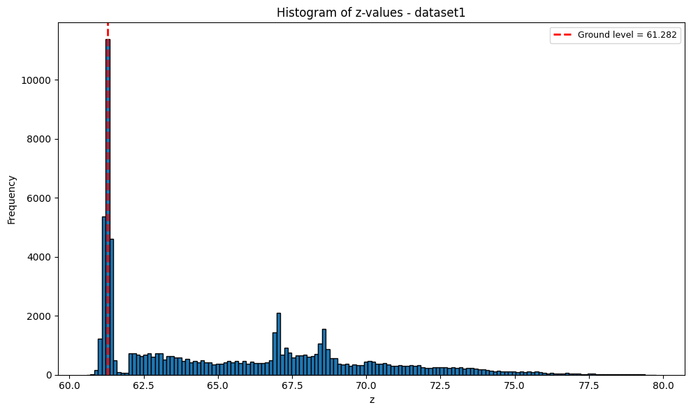
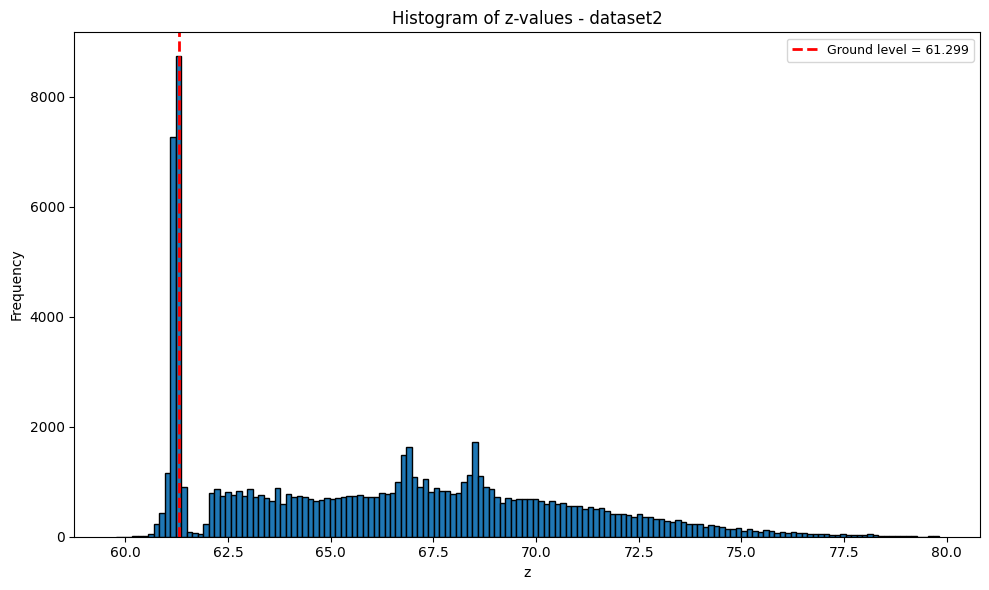
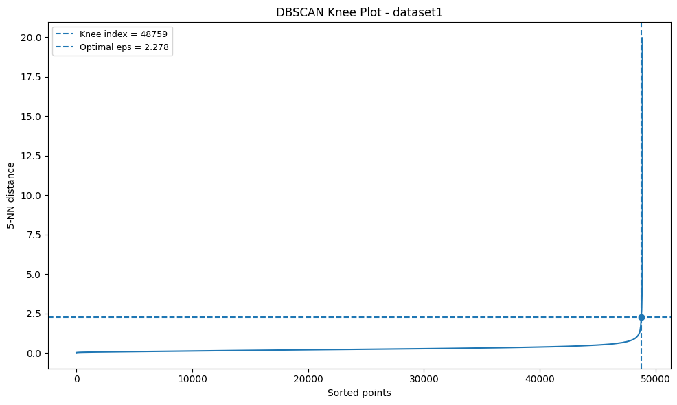
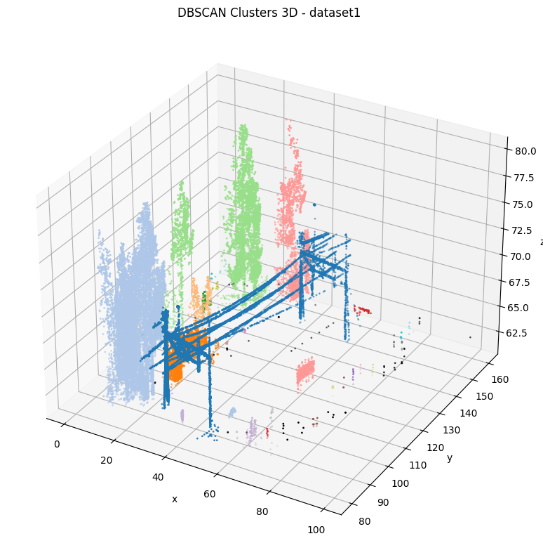
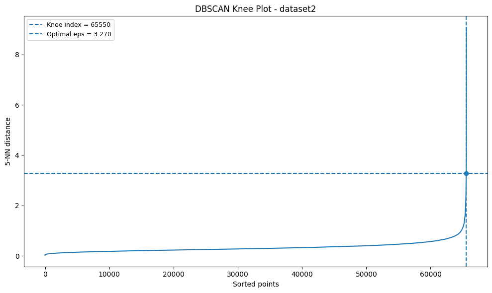
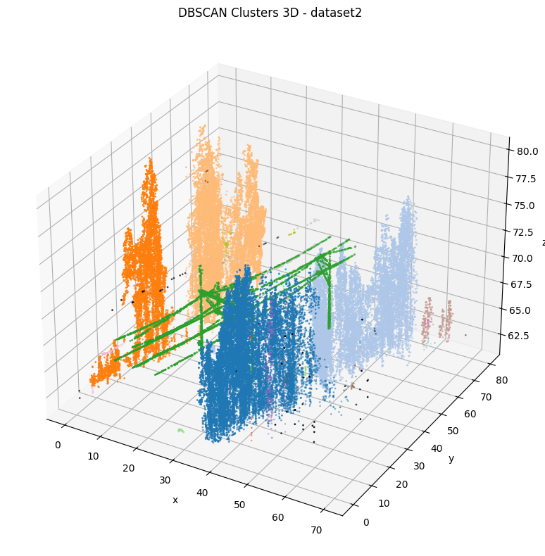
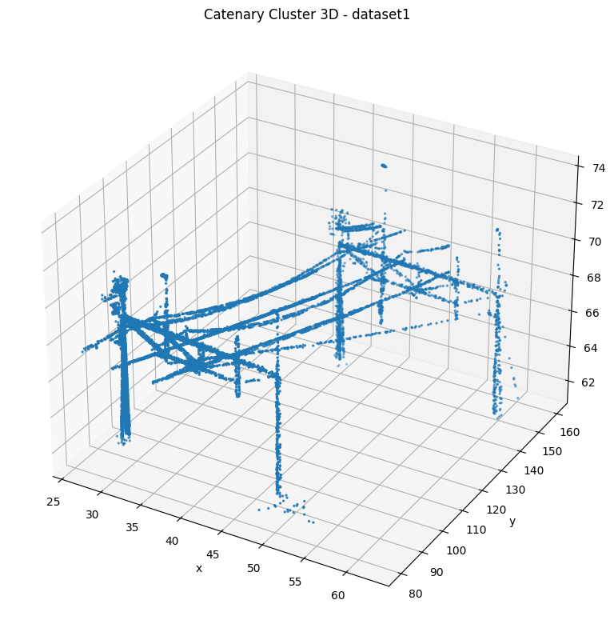
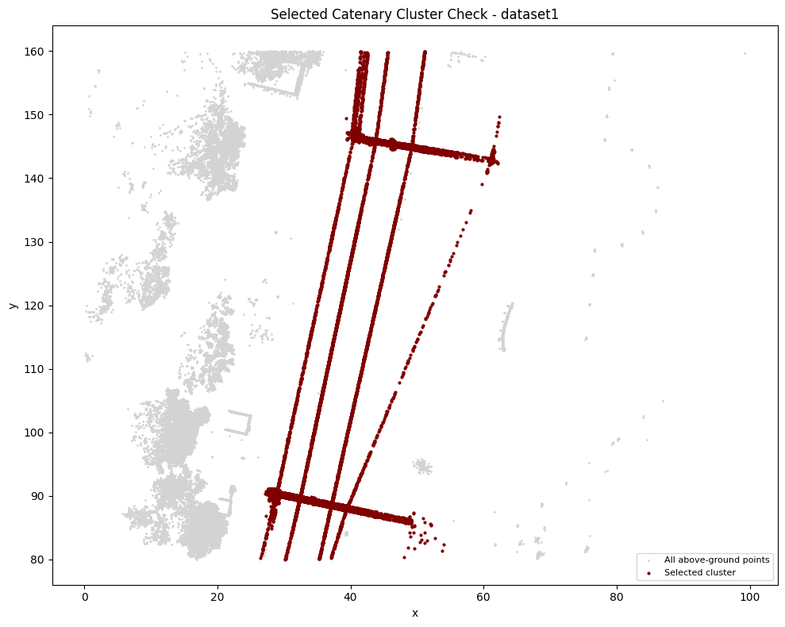
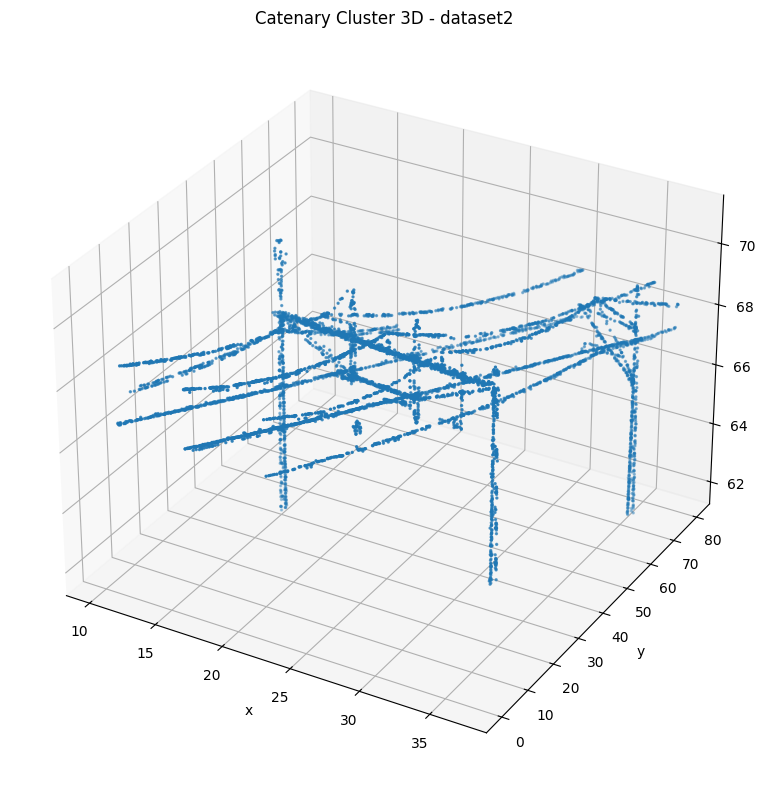
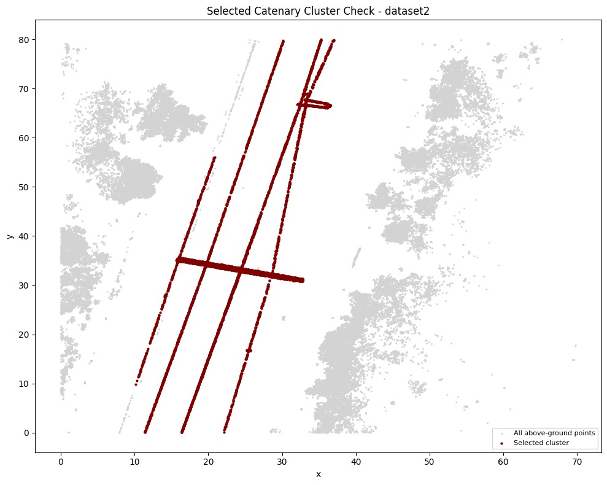

# iai-one-point-cloud
IAI March 2025 - Point Cloud Assignment

## Task 1 – Ground Level Estimation

### Objective
The goal of Task 1 is to estimate the ground level from the LiDAR point cloud data.

### Method
The ground level was estimated using the histogram of the `z` values in the point cloud.

Steps followed:
1. Extract the `z` coordinate from all points in the dataset.
2. Generate a histogram of the `z` values.
3. Identify the histogram bin with the highest frequency.
4. Use the center of that bin as the estimated ground level.

This approach is based on the assumption that the ground forms the densest horizontal layer in the point cloud, so it appears as the strongest peak in the `z`-value distribution.

A small margin above the estimated ground level was then used to keep only the points above ground for the next tasks.

---

### Dataset 1

**Estimated ground level:** 61.282

#### Histogram Plot

#### Observation
For dataset 1, the histogram showed a clear dominant peak in the lower `z` range, which was selected as the ground level.  
This value was then used to remove the ground points before clustering.

---

### Dataset 2

**Estimated ground level:** 61.299

#### Histogram Plot

#### Observation
For dataset 2, the histogram also showed a strong concentration of points at the lower `z` range.  
The center of the densest bin was selected as the estimated ground level and used for above-ground point extraction.

---

### Summary
The histogram-based method provided a simple and effective way to estimate the ground level for both datasets.  
The estimated ground level was then used as the threshold for separating ground points from above-ground structures such as trees, poles, and catenary-related points.

## Task 2 – DBSCAN Parameter Tuning Using Knee/Elbow Plot

### Objective
The goal of Task 2 is to find an optimized value of the DBSCAN parameter `eps` for clustering the above-ground LiDAR points.

### Method
After removing the ground points from each dataset, the DBSCAN `eps` value was estimated using the sorted k-nearest-neighbor distance curve.

Steps followed:
1. Keep only the above-ground points obtained from Task 1.
2. Compute the k-nearest-neighbor distances for each point.
3. Sort the distances in ascending order.
4. Plot the sorted distance curve as a knee/elbow plot.
5. Detect the knee/elbow point from the curve.
6. Use the corresponding distance value as the optimized `eps`.
7. Apply DBSCAN again using the selected `eps`.
8. Visually inspect the clustering result.

The knee/elbow plot helps identify the point where the neighbor distance starts increasing sharply. This point gives a suitable balance between:
- merging nearby points into meaningful clusters
- avoiding excessive merging of different structures
- reducing the number of isolated noise points

---

### Dataset 1

**Knee/Elbow-based optimal `eps`:** 2.278 
**Final `eps` used for DBSCAN:** 2.278

#### Knee/Elbow Plot

#### Cluster Plot

#### Observation
For dataset 1, the knee/elbow plot showed a clear transition in the sorted distance curve.  
The corresponding `eps` value was used for DBSCAN, and the resulting clusters showed a reasonable separation of the major above-ground structures.

---

### Dataset 2

**Knee/Elbow-based optimal `eps`:** 3.270
**Final `eps` used for DBSCAN:** 2.289

#### Knee/Elbow Plot

#### Cluster Plot

#### Observation
For dataset 2, the knee/elbow plot was also used to estimate the initial `eps`.  
After visual inspection of the cluster result, a stricter final `eps` was used to improve the separation between nearby structures such as trees and catenary-related points.

---

### Summary
The knee/elbow-based tuning of `eps` provided a data-driven way to select DBSCAN parameters for both datasets.  
The resulting cluster plots showed that the chosen values were suitable for separating the main above-ground structures and preparing the data for catenary cluster identification in Task 3.

## Task 3 – Catenary Cluster Identification

### Objective
The goal of Task 3 is to identify the catenary cluster from the DBSCAN output after excluding the noise cluster.

### Method
After DBSCAN clustering, the noise cluster with label `-1` was ignored.  
For each remaining cluster, the following values were computed:
- `min(x)`
- `max(x)`
- `min(y)`
- `max(y)`

From these values, the cluster spans were calculated:
- `x span = max(x) - min(x)`
- `y span = max(y) - min(y)`

The catenary cluster was identified as the largest valid cluster based on its `x-y` span.  
Once the catenary cluster was selected, its bounding values were reported and the cluster was plotted separately for visual verification.

---

### Dataset 1

**Selected catenary cluster label:** `0

- `min(x)`: 26.498
- `min(y)`: 80.019
- `max(x)`: 62.379
- `max(y)`: 159.960

#### Catenary Plot

#### Selected Cluster Check

#### Observation
For dataset 1, the selected cluster showed a large spatial span in the `x` and `y` directions and visually matched the catenary structure well.  
The final selected cluster was clearly separated from the ground and most surrounding structures.

---

### Dataset 2

**Selected catenary cluster label:** 6

- `min(x)`: 10.179
- `min(y)`: 0.043
- `max(x)`: 37.007
- `max(y)`: 79.976

#### Catenary Plot

#### Selected Cluster Check

#### Observation
For dataset 2, identifying the catenary cluster was more challenging because nearby elevated structures could merge during clustering.  
After improving the clustering result, the selected cluster was validated visually to confirm that it represented the catenary structure as closely as possible.

---

### Summary
The catenary cluster was identified by excluding the noise cluster and selecting the largest valid cluster using the `x-y` span criterion.  
The final reported `min(x)`, `min(y)`, `max(x)`, and `max(y)` values describe the bounding extent of the detected catenary cluster in each dataset.
